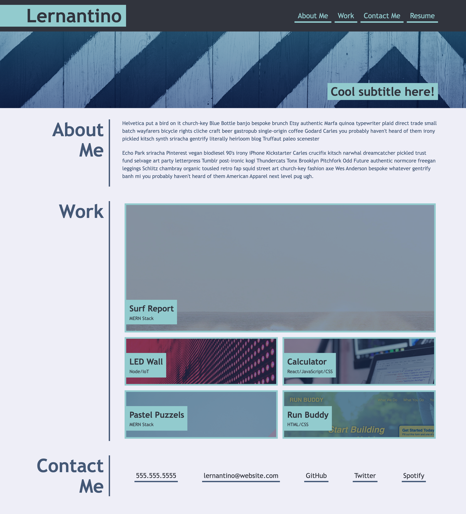

# UTA-bootcamp-Challenge2

## Description

Your Task
Welcome to this week's Challenge! This is an even-numbered week, so you won't be given any starter code. Instead, you'll create a web application from scratch! This week, you'll build a portfolio page, which you can add to as the course progresses.

A portfolio of work can showcase your skills and talents to employers looking to fill a part-time or full-time position. An effective portfolio highlights your strongest work as well as the thought processes behind it. Students who have portfolios with deployed web applications (meaning they are live on the web) are typically very successful in their career search after the boot camp. This last point can’t be stressed enough: having several deployed projects is a minimum requirement to receive an initial interview at many companies.

With these points in mind, in this Challenge you’ll set yourself up for future success by applying the core skills you've recently learned: flexbox, media queries, and CSS variables. You'll get to practice your new skills while creating something that you will use during your job search. It’s a win-win that you'll likely be grateful for in the future!

Note: If you don't have enough web applications to showcase at this point, use placeholder images and names. You can change them to real applications as you create them later in the course.

Let’s take a look at what a user story written from the perspective of a hiring manager might look like. As you might remember from your first Challenge, we follow the AS AN / I WANT / SO THAT format.

## Usage

Provide instructions and examples for use. Include screenshots as needed.

A screenshot has been provided to show what the mock up of our challenge is to the mock-up: Image located below. 

## Credits

List your collaborators, if any, with links to their GitHub profiles.

List your collaborators: Christopher Zavala: https://github.com/ChrisZavala 
Josh Goeke: https://github.com/joshuagoeke
Karen Peazzoni: https://github.com/kpeazzoni

## License

Please refer to the LICENSE in the repo.

---

## Tests

N/A